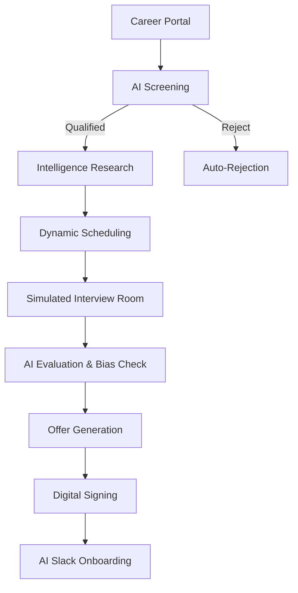

# HireOS — AI-Powered Talent Flow OS

HireOS is an end-to-end, state-driven hiring orchestration system designed to automate the full candidate lifecycle. From initial application to Slack-authenticated onboarding, HireOS treats hiring as a **High-Velocity Decision Engine**, applying AI only at critical leverage points to minimize operational friction and maximize evaluation objectivity.

---

## 🧠 System Architecture & Pipeline

HireOS is built on a 3-layer data architecture:
- **Workflow Layer**: `candidates`, `status_history`.
- **Intelligence Layer**: AI Screening profiles, candidate research briefs.
- **Execution Layer**: `interviews`, `offers`, `email_logs`, `slack_logs`.

### High-Level Flow (Mermaid)

---

## 🚀 Assignment Phase Mapping

| Phase | Module | Implementation Summary |
| :--- | :--- | :--- |
| **01** | **Career Portal** | Public application interface with multi-file resume uploads. |
| **02** | **Screening** | AI Parsing → Fit Scoring → Strength/Gap analysis. |
| **03** | **Research** | LinkedIn/GitHub signal extraction & inconsistency detection. |
| **04** | **Scheduling** | Validation-on-selection slot system with rescheduling loops. |
| **05** | **Interview** | Unified Room UI with AI Notetaker simulation. |
| **06** | **Evaluation** | Transcript synthesis, recommendation, and unconscious bias check. |
| **07** | **Offer** | HR form entry → AI-generated letter → In-app digital signing. |
| **08** | **Onboarding** | AI-personalized Slack welcomes & HR notification triggers. |

---

## 🛠 Core Module Deep-Dives

### 1. AI Screening (Decision Logic)
**AI Usage:** LLM-powered extraction converts unstructured PDFs into a structured "Fit Score" (0-100).
- Matches skills, experience, and education against role requirements.
- Generates a "Hiring Recommendation" (Advance/Reject) based on specific candidate gaps.
- **Not used:** AI does not make the final "HIRE" decision; it qualifies candidates for HR review.

### 2. Candidate Research & Enrichment
**Technical Logic:** Aggregates resume data with GitHub/LinkedIn signals to generate a **Candidate Brief**.
- Identifies "Red Flags" or inconsistencies between profiles.
- **Limitation:** Twitter/X API integration is NOT implemented (acknowledged).

### 3. Dynamic Scheduling System
**Design Choice:** *Validation-on-selection* (Optimistic Concurrency).
- **No persistent locking:** Slots are generated on-the-fly to prevent "slot starvation."
- **Conflict Handling:** Database unique constraints prevent double-booking. If a slot is taken mid-click, the system auto-regenerates fresh slots instantly.
- **Rescheduling:** Candidate can request a different time → HR triggers an "Approve/Reject" review loop. Only one active request is permitted per candidate.
- **Cron Follow-ups:** A Vercel cron job checks for `last_contacted_at` + 48hrs of inactivity to trigger follow-up alerts, preventing duplicate spam.

### 4. Interview Pipeline (Evaluation)
**Status:** Simulated interface for demo purposes.
- **AI Notetaker:** Stimulated real-time transcription and signal detection.
- **Verification:** Automatically evaluates transcripts for strengths/concerns and bias detection.
- **Real-world target:** Designed for seamless [Fireflies.ai](https://fireflies.ai/) integration (documented but currently simulated).

### 5. Offer & Digital Signing
**The Experience:** 
- HR inputs salary/equity/manager details → AI generates a formal letter.
- **Security:** Secure signing portal captures signature data, timestamp, IP, and generates a simulated SHA256 audit hash.

### 6. Production Slack Integration (Minimalist)
**The Approach:**
- **Bot Token Based:** Uses `xoxb-` token for direct API interaction.
- **Direct Triggers:** Fires AI-personalized messages to `#general` and alerts HR in `#hr-notifications` upon offer signature.
- **Logs:** Persistent `slack_logs` for observability.
- **Excluded:** No OAuth, no user provisioning, no workspace join detection (simplicity prioritizes reliability).

---

## 📡 Communication & Observability
HireOS includes a built-in **Communication Ledger** (`email_logs` and `slack_logs`).
- Every outbound system communication is tracked with recipient, subject, preview, and delivery status.
- This provides HR teams full audit visibility without needing access to external provider dashboards.

---

## ⚖️ Edge Cases & Resilience

1. **Slot Conflict:** Handled via database transaction rollback & auto-slot regeneration.
2. **Candidate Inactivity:** 48-hour cron window prevents pipeline stagnation.
3. **Duplicate Applications:** Managed via primary email constraints.
4. **Rescheduling Race Conditions:** Locked until HR decision is recorded.
5. **AI Fallback:** Safe defaults used if LLM generation fails (e.g., standard welcome message vs. AI personalized).

---

## 🔮 Trade-offs & Limitations

- **Trade-off: Cron vs. Real-time:** Used Vercel Cron for follow-ups to minimize backend overhead for demo purposes.
- **Trade-off: No OAuth:** Standard bot tokens used for Slack to avoid complex OAuth redirection flows.
- **Mocked Components:** Notetaker is simulated; Calendar integration uses an internal slot engine instead of Google/Outlook OAuth.
- **Limitations:** Twitter/X data enrichment is NOT implemented; Slack join detection is excluded in favor of direct API triggers.

---

## 🗺 Future Roadmap
- [ ] **Calendar OAuth:** Real-time sync with HR availability.
- [ ] **PDF Generation:** Server-side PDF generation for signed agreements.
- [ ] **Analytics:** Funnel metrics tracking (Application -> Hire duration).
- [ ] **Realtime:** Live status updates via Supabase Realtime sockets.

---

## 🧠 Philosophy: HireOS as a Workflow Orchestrator
HireOS is not a "magic AI" hiring box. It is a **workflow orchestrator** that uses AI to eliminate administrative "dark matter." By handling the follow-ups, scheduling conflicts, parsing, and notifications, HireOS allows HR teams to scale their human touch without being drowned in the process.