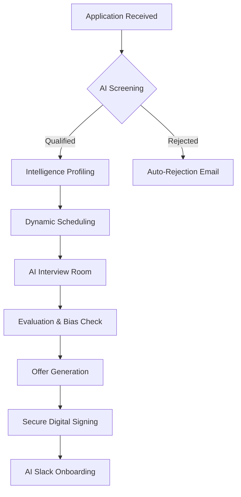

# HireOS — AI-Powered Talent Flow OS

HireOS is an end-to-end AI-driven hiring system designed to automate and orchestrate the full candidate lifecycle — from initial application to day-one onboarding.

Rather than treating hiring as a collection of disconnected tools, HireOS is built as a **High-Velocity Decision Engine**, where AI is applied at critical friction points to reduce manual overhead, ensure objective evaluation, and minimize time-to-hire.

---

## 🧠 System Architecture & Flow

HireOS operates as a state-driven pipeline. Each candidate moves through a series of "Phases," each governed by automated triggers and AI insights.

---

## 🚀 Core Infrastructure Modules

### 1. AI Screening & Scoring Pipeline
**Technical Logic:**
- **Parsing:** Uses LLMs to extract structured JSON from unstructured PDF resumes (skills, years of experience, past companies).
- **Matching:** Compares candidate signals against role-specific requirements.
- **Output:** Returns a "Fit Score" (0-100) and a list of specific "Strengths" vs. "Gaps."

### 2. Intelligent Availability & Scheduling
**Design Choice:** *Validation-on-selection* (Optimistic Locking).
- **Dynamic Slots:** Generates timeslots in real-time by checking HR availability and existing interview "Holds."
- **Conflict Resolution:** If two candidates click the same slot simultaneously, the database unique constraints prevent double-booking, and the second candidate is gracefully prompted to select a new time.
- **Rescheduling Loop:** Candidates can submit a rescheduling request if slots don't work, triggering an HR review workflow in the admin dashboard.

### 3. AI Interview Room & Notetaker
**The Experience:**
- Real-time simulated interview interface with an automated "AI Notetaker."
- Generates live transcriptions and key signals during the conversation.
- **Post-Interview Analysis:** Automatically checks for unconscious bias and provides a "Hire/No-Hire" recommendation based on the transcript.

### 4. Direct Slack Onboarding (Production-Ready)
**Capabilities:**
- **Bot-Driven:** Uses a Slack Bot Token (`xoxb-`) for direct, authenticated communication without OAuth overhead.
- **AI Welcome:** Generates a personalized greeting for the candidate's name, role, and manager.
- **HR Sync:** Notifies the HR channel with a one-click dashboard link to the hire's profile.
- **Observability:** Logs every Slack action to a `slack_logs` table for traceability.

---

## 📑 Database Schema Overview

| Table | Purpose | Deep Dive |
| :--- | :--- | :--- |
| `candidates` | Central registry | Stores PII, bio-data, and the canonical `status` (APPLIED -> HIRED). |
| `roles` | Job tracking | Requirements, team ownership, and role-specific AI prompts. |
| `interviews` | Event tracking | Scheduled times, room links, and AI-generated summaries. |
| `offers` | Financial/Legal | Salary, equity, signing tokens, and digital signature audit trails. |
| `email_logs` | Observability | A ledger of every email sent, including subject, preview, and status. |
| `slack_logs` | Observability | A ledger of Slack notifications and AI-generated welcome messages. |

---

## 🛠 Tech Stack

- **Framework:** [Next.js 14](https://nextjs.org/) (App Router & Server Actions)
- **Database/Auth:** [Supabase](https://supabase.com/) (PostgreSQL + Row Level Security)
- **Styling:** Vanilla CSS + Modern Flex/Grid (Mobile Responsive)
- **AI Engine:** Multi-provider support (OpenAI, Anthropic, Google Gemini)
- **Email:** SendGrid / Resend with custom template engine
- **Messaging:** Slack Web SDK

---

## ⚠️ Simulated vs. Production Realities

To prioritize system architecture over third-party API dependencies during development:
1. **Interview Room:** Notetaking is simulated with realistic temporal delays to demo the user experience.
2. **Signature Hashes:** Audit hashes (SHA256) are generated and stored but do not currently link to a public blockchain or external notary service (standard digital audit trail).
3. **Email:** While integrated with SendGrid, the system defaults to an internal `email_logs` ledger for local development/debugging visibility.

---

## 🔮 Roadmap: The Future of HireOS

1. **Google/Outlook Calendar Integration:** Replace the internal scheduling engine with full OAuth-based calendar sync.
2. **Server-Side PDF Generation:** Use Puppeteer to generate formal, locked PDF copies of signed employment agreements.
3. **Voice Interview Agent:** Integrate AI voice models (like OpenAI Realtime) for initial screening calls.
4. **Talent Analytics:** Build a conversion funnel to track drop-off rates at every stage of the lifecycle.

---

## 🧠 The Philosophy of HireOS

HireOS isn't about replacing recruiters; it's about **removing the administrative noise.** By applying AI where it reduces decision friction, HireOS allows hiring managers to focus on the human side of building teams while the system handles the orchestration.